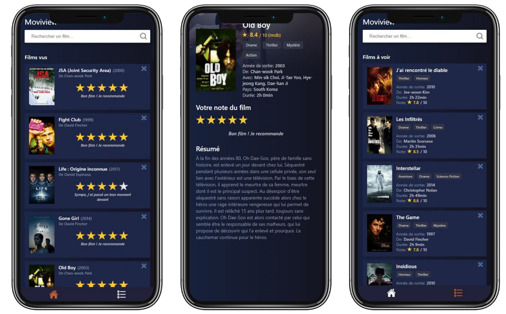

# Moviview

## What is moviview ?

Moviview is a PWA which allow you to search movies in order to have information about them, rate them and classify them in two list:

- Movies to watch : Useful to keep in mind some movies that you've heard of.
- Watched Movies : Allow you to etablish a list of movies you've ever seen with your own rate.

this project use two apis :

- [themoviedb](https://www.themoviedb.org/documentation/api)
- [OMDb API](http://www.omdbapi.com/)

## Objectives

The main goals of the project was to learn the basic of React, Redux, Enzyme and create my first PWA at the same time.

## Preview

## About the project

This project was bootstrapped with [Create React App](https://github.com/facebook/create-react-app) with the version 16.13.1 of React.
It uses [Enzyme](https://github.com/enzymejs/enzyme) to test components.

### Available Scripts

In the project directory, you can run:

#### `npm start`

Runs the app in the development mode.
Open [http://localhost:3000](http://localhost:3000) to view it in the browser.

The page will reload if you make edits.
You will also see any lint errors in the console.

#### `npm test`

Launches the test runner in the interactive watch mode.
See the section about [running tests](https://facebook.github.io/create-react-app/docs/running-tests) for more information.
